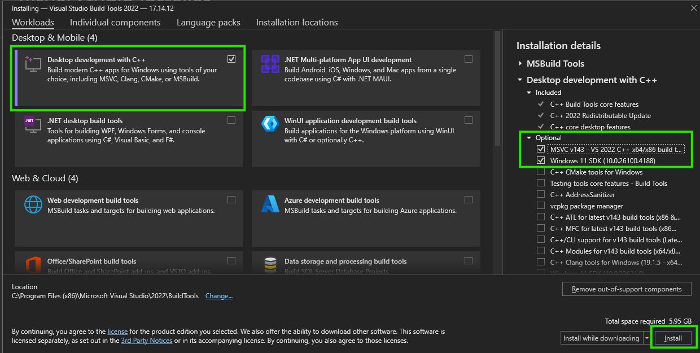

# Nando Lang

[](https://github.com/hintron/nando-lang/actions/workflows/ci.yml)

This repo contains a set of beginning exercises and tasks to help you learn the
C programming language and basic CPU architecture.

These tasks are meant for beginners who know very basic programming in a
high-level language. Basic knowledge of functions, variables, strings, loops,
etc. will be assumed by the exercises, though C-specific syntax will not be.

> [!IMPORTANT]
> As a prerequisite, please do the "Learn the Basics" portion
> of the [Learn C](https://www.learn-c.org/) exercises (at least complete up to
> the "Functions" lesson).

Avoid the temptation to look at solutions or to use AI - these exercises
are designed to help you learn by doing, so try to solve them on your own,
and type them out manually.


# Quickstart

## Make sure C compilers are installed

We will install different C compilers depending on the operating system (OS) you
use. The main operating systems are macOS (Apple), Windows (Microsoft), and
Linux.

> [!TIP]
> The most popular C compilers (like MSVC) are really a combined C and
> C++ compiler, since C++ is a superset of C. This means that C programs are
> also valid C++ programs.


### macOS

The `clang` C/C++ compiler should automatically be avaialable to use.


### Linux (or WSL)

The `gcc` C/C++ compiler should automatically be available to use. If it's not,
install the "build-essentials" or "gcc" package for you Linux distro.

E.g., for Ubuntu, do:
```
sudo apt install build-essentials
```

`clang` can also be installed on Linux if you prefer `clang`.


### Windows

> [!TIP]
> If you are on Windows, but want to use a Linux environment, consider
> using Window's WSL (Windows Subsystem for Linux). This gives you a full Linux
> installation on Windows, and you can then follow the Linux instructions.

For Windows, we will install the native `msvc` C/C++ compiler.

* Go to the [Visual Studios downloads page](https://visualstudio.microsoft.com/downloads/#build-tools-for-visual-studio-2022)
* Download ["Build Tools for Visual Studio 2022"](https://aka.ms/vs/17/release/vs_BuildTools.exe)
* Run `vs_BuildTools.exe`
* Under the "Workloads" tab, select "Desktop development with C++"
  
* Click `Install`
* Search for `Developer PowerShell for VS 2022` and run it
* In PowerShell, change the directory to where you downloaded Nando Lang
  ```
  cd <path-to-nando-lang>
  ```

> [!NOTE]
> For official documentation on how to install a C compiler on Windows, see
> [Walkthrough: Compile a C program on the command line](https://learn.microsoft.com/en-us/cpp/build/walkthrough-compile-a-c-program-on-the-command-line?view=msvc-170)


### Download

To download Nando lang, go to https://github.com/hintron/nando-lang/releases and
download the source code. Extract it to a directory

(Don't use Git to clone the repo. We're keeping it simple.)


### Compile the Checker Program

First, determine the terminal program to use.

* macOS: `terminal`
* Linux: `konsole`
  * (If using WSL, you will already be using a terminal program.)
* Windows: Developer PowerShell for VS 2022
  * (You must use a "Developer" version of PowerShell, or else `msvc` will
    not be available.)


Next, go inside the nando-lang directory you just downloaded:

```
cd <path-to-nando-lang-directory>
```

> [!TIP]
> Use [tab completion](https://en.wikipedia.org/wiki/Command-line_completion) to
> quickly select file paths in the terminal and as a sanity check that the file
> exists.

Then, build the checker program with the following command, depending on which
OS you are on:

```
# If on Linux:
gcc src/main.c -o main
# If on macOS
clang src/main.c -o main
# If on Windows
cl src/main.c
```


Next, run the checker with no arguments:

```
./main
```

This will display an introductory blurb with your first instructions. These
instructions will tell you what exercise to first start editing.

### Edit, Compile, and Run Exercise Code

Edit your source code files using a coding text editor like
[VSCode](https://code.visualstudio.com/) or
[NeoVim](https://github.com/neovim/neovim).

Once you have edited the exercise, compile it in your terminal with this
command:

```
# Linux
gcc exercises/<exercise>.c -Wall
# macOS
clang exercises/<exercise>.c -Wall
# Windows
cl exercises/<exercise>.c /W4 /Fea.out.exe
```

Replace `<exercise>.c` with the exercise you are working on.

> [!TIP]
> The `-Wall`/`/W4` are optional - they will display warnings that could indicate problems
> in your code, but these warnings do not prevent the code from being compiled.

This will compile your code and generate `a.out` if compilation succeeded.
`a.out` is your compiled program. Each time you compile, `a.out` will get
overwritten with the latest compiled changes to your program.

Run `a.out` to make sure your program does what you wanted:

```
./a.out
```

When you are satisfied that it does what you want, give it to the checker to run
and see if you pass the exercise!:

```
./main a.out
```

If you pass, the checker will tell you the next exercise to work on.


# C Learning Resources

## C Reference

For a basic C syntax reference, see

* [Wikibooks - C Programming](https://en.wikibooks.org/wiki/C_Programming)
* [CS50x 2024 - Lecture 1 - C (YouTube)](https://youtu.be/cwtpLIWylAw?si=6ipzrHEzzsCXtRve)
* [Learn C](https://www.learn-c.org/)
* [C Beginner's Handbook](https://www.freecodecamp.org/news/the-c-beginners-handbook/)

En espanol:

* [Lenguaje C](https://informatica.uv.es/estguia/ATD/apuntes/laboratorio/Lenguaje-C.pdf)
* [Wikilibros - Programación en C](https://es.wikibooks.org/wiki/Programaci%C3%B3n_en_C)
* [Learn C](https://www.learn-c.org/es/)
* [Aprende C en 45 minutos (curso desde cero)](https://www.youtube.com/watch?v=1-qjMS6C960)
* [El Manual para principiantes C](https://www.freecodecamp.org/espanol/news/el-libro-para-principiantes-c-aprende-las-bases-del-lenguaje-de-programacion-c-en-solo-unas-horas/)

## Advanced concepts

Pointers

* [Watch this 3-minute pointers explanation](https://www.boot.dev/lessons/f6b606aa-cca7-4043-9689-6d72117a69ca)


En espanol:

* [Punteros en C](https://www.youtube.com/watch?v=y3K3jb3wv2I)
* []()
* []()
* []()
* []()


